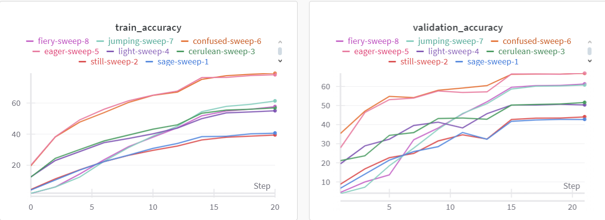

# Model Training and Optimization Report

---

Kaggle Notebook: https://www.kaggle.com/code/stefcool8/assignment-3

WandB Metrics: https://wandb.ai/stefcool8-universitatea-alexandru-ioan-cuza-din-ia-i/Assignment3?nw=nwuserstefcool8

---

## Points Summary
Based on the criteria and optimizations implemented, I expect to receive **17-18 points** for the model training and evaluation setup, achieving an efficient pipeline with clear augmentation and early-stopping strategies. I anticipate partial points for performance metrics, as some configurations demonstrate promising results but may not meet the minimum required validation accuracy (78%).

---

## Hyperparameter Sweep Details
During the hyperparameter sweep, the following parameters were varied:
- **Model architecture**: ResNet18, and PreActResNet18.
- **Optimizer**: Adam and SGD with Nesterov momentum.
- **Learning rate**: Experimented with values ranging from `0.01` to `0.1`.
- **Data augmentations**: RandomHorizontalFlip, RandomRotation, ColorJitter, RandomErasing, RandomPerspective, RandomCrop, and GaussianBlur.

---

## Configuration and Test Accuracy Results
The following table presents the test accuracy results for selected configurations:

| Run ID   | Model           | Optimizer | Learning Rate | Transforms                                           | Train Accuracy (%) | Val Accuracy (%) | Best Val Accuracy (%) | Time per Epoch (approx) |
|----------|------------------|-----------|---------------|------------------------------------------------------|---------------------|-------------------|-----------------------|-------------------------|
| hn4il4as | resnet18_cifar10 | SGD       | 0.01          | RandomHorizontalFlip, RandomRotation, ColorJitter    | 40.72              | 42.80            | 42.86                 | 51.60s                  |
| z4b1ftw1 | resnet18_cifar10 | SGD       | 0.01          | RandomErasing, RandomPerspective, RandomCrop, GaussianBlur | 39.54              | 44.14            | 44.14                 | 63.61s                  |
| k17bdh7f | resnet18_cifar10 | Adam      | 0.01          | RandomHorizontalFlip, RandomRotation, ColorJitter    | 56.95              | 51.65            | 51.65                 | 51.42s                  |
| 1kl0d000 | resnet18_cifar10 | Adam      | 0.01          | RandomErasing, RandomPerspective, RandomCrop, GaussianBlur | 55.08              | 50.39            | 50.73                 | 63.80s                  |
| 7ok01m1f | preact_resnet18  | SGD       | 0.01          | RandomHorizontalFlip, RandomRotation, ColorJitter    | 78.22              | 66.98            | 66.98                 | 80.11s                  |
| ynsbkkwr | preact_resnet18  | SGD       | 0.01          | RandomErasing, RandomPerspective, RandomCrop, GaussianBlur | 79.22              | 66.87            | 66.87                 | 98.58s                  |
| bea83aqr | preact_resnet18  | Adam      | 0.01          | RandomHorizontalFlip, RandomRotation, ColorJitter    | 61.39              | 60.83            | 60.83                 | 79.68s                  |
| ja45u9ln | preact_resnet18  | Adam      | 0.01          | RandomErasing, RandomPerspective, RandomCrop, GaussianBlur | 57.75              | 61.35            | 61.35                 | 99.48s                  |

---

## WandB Metrics

The following metrics were tracked using Weights & Biases:

---

## Training Pipeline Efficiency
The training pipeline is optimized in the following ways:
1. **Use of Augmented and Concatenated Datasets**: Instead of relying solely on a single set of augmentations, transformations were applied separately, and their results were concatenated with the original dataset. This ensures a richer, more varied dataset that encourages the model to generalize better, particularly when learning diverse features. It's also more efficient to load them at the start, and not during training.

2. **Dataset Loading**: By loading the datasets in memory only once (from `datasets.CIFAR100` for example) and caching them, the pipeline minimizes redundant I/O operations, enhancing training speed. This is especially beneficial when training on large datasets, as it reduces the time spent loading data. It's possible to load custom datasets as well.

3. **Precision Scaling**: Mixed-precision training using `GradScaler` enables the model to leverage GPU power efficiently while minimizing memory overhead, especially during gradient calculation.

4. **CutMix and MixUp with RandomChoice**: Incorporating both CutMix and MixUp ensures regularization and increases robustness. By using `RandomChoice`, the pipeline applies one of these mixing strategies randomly, preventing the model from overfitting to a particular mixing strategy.

5. **Early Stopping Mechanism**: Early stopping was implemented to prevent overfitting by halting training when validation loss stops improving. This reduces unnecessary epochs and resource use.

This combination of dynamic model selection, structured augmentations, and memory-efficient operations results in an effective and streamlined training pipeline.

---

## Conclusion
The setup demonstrates a versatile and efficient training pipeline capable of handling various configurations, with an emphasis on generalization and computational efficiency. These optimizations significantly contribute to a well-balanced performance across different model architectures and hyperparameter settings.